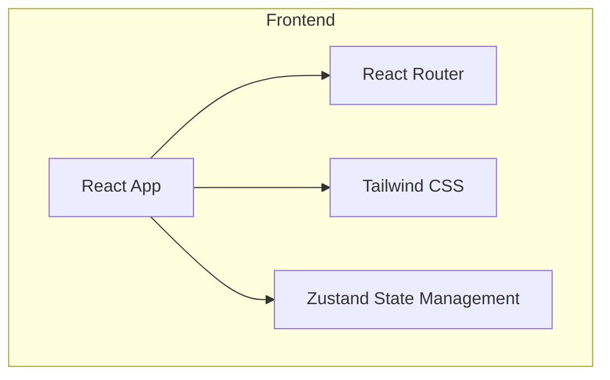

## 1. 架构设计



## 2. 技术描述
- 前端: React@18 + TypeScript + Vite
- 初始化工具: vite-init
- 后端: 无（纯前端官网）
- 数据库: 无
- UI框架: Tailwind CSS
- 状态管理: Zustand
- 路由: React Router
- 图标库: lucide-react

## 3. 路由定义
| 路由 | 用途 |
|------|------|
| / | 首页，包含英雄区、功能展示、AI演示等 |
| /help | 帮助中心首页 |
| /help/getting-started | 入门指引 |
| /help/manual | 操作手册 |
| /help/api | API接入文档 |
| /partner | 成为分销商申请表单页 |

## 4. 文件结构
```
src/
├── components/
│   ├── Navbar.tsx        # 导航栏组件
│   ├── Hero.tsx          # 英雄区组件
│   ├── Features.tsx      # 核心功能组件
│   ├── AIDemo.tsx        # AI对话演示组件
│   ├── Testimonials.tsx  # 客户评价组件
│   ├── CTA.tsx           # CTA区域组件
│   ├── HelpSidebar.tsx   # 帮助中心侧边栏
│   └── Footer.tsx        # 页脚组件
├── pages/
│   ├── Home.tsx          # 首页
│   ├── HelpCenter.tsx    # 帮助中心首页
│   ├── GettingStarted.tsx # 入门指引页
│   ├── Manual.tsx        # 操作手册页
│   ├── APIDocs.tsx       # API文档页
│   └── PartnerForm.tsx   # 分销商申请表单页
├── utils/
│   └── animations.ts     # 动画工具函数
├── App.tsx               # 应用入口
└── main.tsx              # React入口
```

## 5. 核心组件设计

### Navbar组件
- 固定顶部导航
- 响应式设计，移动端汉堡菜单
- Logo和导航链接

### Hero组件
- 渐变背景
- 大标题和副标题
- AI对话演示界面
- CTA按钮

### Features组件
- 三列卡片布局
- 每个功能卡片包含图标、标题、描述
- 悬停动画效果

### AIDemo组件
- 聊天界面样式
- 模拟AI对话
- 打字机效果

### Testimonials组件
- 客户评价卡片
- 轮播效果

### HelpSidebar组件
- 帮助中心导航菜单
- 激活状态高亮
- 响应式折叠

### Footer组件
- 网站底部信息
- 链接导航
- 版权声明

### PartnerForm组件
- 分销商申请表单
- 表单验证
- 提交反馈
