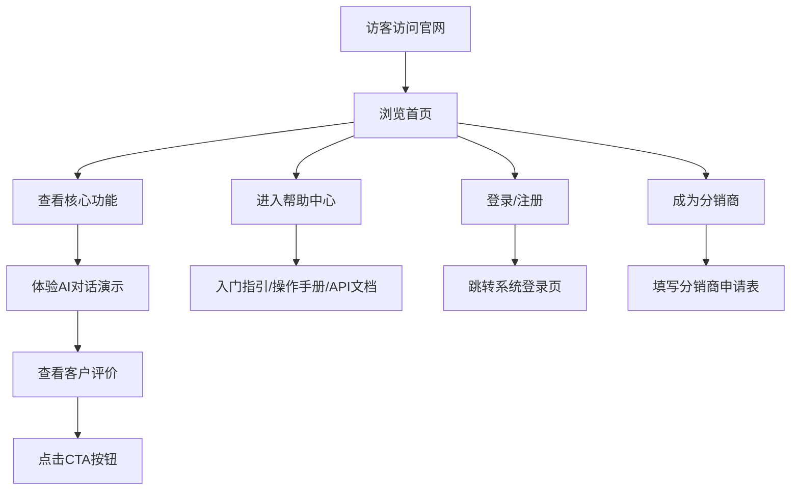

## 1. 产品概述
AI报销系统官网，展示基于AI对话的智能报销解决方案，支持灵活嵌入协同办公平台，提供发票验真验重功能。目标用户为企业财务人员、行政人员及普通员工。

## 2. 核心功能

### 2.1 用户角色
| 角色 | 访问方式 | 核心权限 |
|------|---------|---------|
| 访客 | 浏览器访问 | 浏览网站内容、了解产品功能、查看案例 |

### 2.2 功能模块
1. **首页**: 英雄区、导航栏、核心功能展示、AI对话演示、客户评价、CTA区域
2. **功能页**: 详细功能介绍、使用场景演示
3. **定价页**: 套餐介绍、企业定制方案
4. **帮助中心**: 入门指引、操作手册、API接入文档
5. **登录/注册**: 跳转至系统登录页入口
6. **成为分销商**: 分销商权限申请表单

### 2.3 页面详情
| 页面名称 | 模块名称 | 功能描述 |
|---------|---------|---------|
| 首页 | 英雄区 | 产品标题、核心价值主张、AI对话演示框、CTA按钮 |
| 首页 | 导航栏 | Logo、产品功能、定价、案例、帮助中心、登录/注册、成为分销商 |
| 首页 | 核心功能展示 | AI对话报销、嵌入办公平台、验真验重三大核心功能卡片 |
| 首页 | AI对话演示 | 模拟AI交互界面，展示报销流程 |
| 首页 | 客户评价 | 企业客户反馈轮播 |
| 首页 | CTA区域 | 免费试用、预约演示按钮 |
| 帮助中心 | 入门指引 | 新用户快速上手指南 |
| 帮助中心 | 操作手册 | 详细功能使用说明 |
| 帮助中心 | API接入文档 | 开发者接口文档 |
| 成为分销商 | 申请表单 | 企业信息、联系人信息、合作意向等表单字段 |

## 3. 核心流程
访客访问官网 → 浏览英雄区了解产品 → 查看核心功能 → 体验AI对话演示 → 查看客户评价 → 点击CTA进行下一步（免费试用/预约演示）
或：访客访问官网 → 导航栏选择帮助中心 → 查看文档；或：访客访问官网 → 点击登录/注册 → 跳转系统登录页；或：访客访问官网 → 点击成为分销商 → 填写申请表单

## 4. 用户界面设计
### 4.1 设计风格
- 主色调：深蓝色（#1e40af）搭配科技感的青色（#06b6d4）
- 按钮风格：圆角矩形，带有微妙的渐变和悬停动画
- 字体：使用现代无衬线字体，标题使用具有科技感的展示字体
- 布局风格：卡片式布局，层次分明，留白充足
- 图标风格：简约线性图标，来自lucide-react库

### 4.2 页面设计概述
| 页面名称 | 模块名称 | UI元素 |
|---------|---------|-------|
| 首页 | 英雄区 | 渐变背景、大标题、简洁副标题、AI对话界面演示、主按钮和次要按钮 |
| 首页 | 核心功能 | 三列卡片布局、图标+标题+描述、悬停动画效果 |
| 首页 | AI演示 | 聊天界面样式、消息气泡、打字机效果 |
| 首页 | 客户评价 | 卡片轮播、头像+姓名+职位+评价内容 |
| 帮助中心 | 文档导航 | 侧边栏导航、内容区、搜索框 |
| 成为分销商 | 申请表单 | 表单布局、输入框、下拉选择、提交按钮 |

### 4.3 响应式
采用桌面优先设计，适配平板和移动端，确保在各种设备上都有良好的体验。

### 4.4 动效设计
- 页面加载时的渐入动画
- 滚动触发的元素显示动画
- 按钮悬停和点击反馈
- AI对话打字机效果
