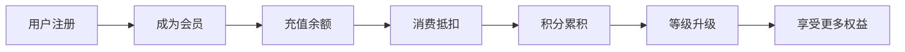

# 产品需求文档 (PRD)

## 1. 产品概述

**项目名称**: 悦汇商业综合体管理系统

**项目概述** (2行内):
大型多业态、封闭式与半封闭式结合的体验型商业体核心管理系统，集成票务、会员、收银、资产租赁、设备控制等核心功能。

**核心价值**:
- 实现"门票经济 + 场内二次消费 + 会员运营 + 资产租赁"四位一体的商业模式
- 通过IoT设备与软件系统联动，打造智能化商业体运营体系

---

## 2. 用户角色

| 角色 | 描述 | 访问终端 |
|------|------|----------|
| 终端消费者 | 来商场消费的普通顾客 | 微信小程序/H5 |
| 综合服务台人员 | 主入口服务台工作人员 | Android触屏端 |
| 业态现场服务人员 | VR影院、足浴等区域服务人员 | 微信小程序 |
| 后台运营管理人员 | 运营、财务、招商等管理者 | PC Web管理后台 |
| 系统管理员 | IT或技术维护人员 | PC Web管理后台 |
| 外部系统 | 第三方平台对接 | API |

---

## 3. 核心功能模块

### 3.1 综合票务管理
- **票种配置**: 通票/单票/套餐模板管理、定价、权益配置（次数/时长）、有效期设置
- **售票**: 线下快速出票、会员折扣自动计算、多种收款方式、电子票发送
- **验票**: 闸机/手持设备扫码验票、实时权限校验、通行日志记录
- **退票**: 线上退票申请、后台审批、退款计算、原路退回

### 3.2 收银管理
- **服务台收银**: 商品/服务开单、多方式收款、小票打印
- **手环预存消费**: 手环充值、刷手环扣费、消费明细查询
- **押金管理**: 收取/退还押金、损坏扣款、对账报表
- **财务对账**: 日结、支付渠道账单、异常交易标记

### 3.3 会员管理
- **会员体系**: 多等级设置、自动/手动升降级、业态折扣配置
- **会员服务**: 小程序注册、在线充值、消费记录、信息修改
- **外部同步**: 与王中王超市系统双向同步会员信息、等级、积分

### 3.4 资产管理
- **资产档案**: 房屋资产台账、户型图/照片、资产状态标注
- **租赁管理**: 租赁合同管理、租金/物管费/水电费计算、缴费账单生成
- **收缴管理**: 费用收取记录、逾期催缴、应收/实收/欠费报表
- **招商信息**: 未租资产展示、合作意向收集

### 3.5 报表管理
- **经营分析**: 多维度销售统计、同比/环比分析
- **会员分析**: 会员增长、活跃度、复购率、等级分布
- **票务分析**: 销量、核销率、退票率、渠道贡献度
- **设备分析**: 启动频次、使用时长、故障率、坪效分析
- **报表导出**: Excel/PDF导出、自定义报表、邮件推送

### 3.6 移动端应用
- **用户端小程序**: 在线购票、会员中心、我的门票二维码、消费记录、招商浏览
- **管理端小程序**: 经营概览、扫码验票、退票处理、设备监控、告警接收
- **服务台触屏端**: 票务销售、手环管理、订单查询、退票处理、交接班

### 3.7 系统管理
- **权限管理**: 用户创建、角色自定义、权限分配
- **参数配置**: 全局参数设置、数据字典维护
- **安全审计**: 操作日志记录、条件检索追溯

### 3.8 设备与第三方对接
- **门禁/闸机**: 二维码/手环验证、远程开闸、通行记录
- **智能手环**: 发放/挂失/注销、余额读写、账户绑定
- **游乐设备**: 扫码启停台球/电玩/保龄球、计时控制
- **无人售货柜/售币机**: 扫码支付、库存监控、补货预警
- **厨房显示系统**: 点餐订单推送、制作状态更新、叫号取餐
- **第三方平台**: 美团/饿了么/抖音订单同步、微信支付对接

---

## 4. 核心流程

### 4.1 票务消费流程

### 4.2 会员服务流程

### 4.3 手环使用流程

---

## 5. 页面清单

### 5.1 用户端小程序/H5

| 页面名称 | 模块 | 功能描述 |
|----------|------|----------|
| 首页 | 轮播图、导航、公告 | 展示入口、优惠信息 |
| 票务中心 | 票种列表、详情、购买 | 通票/单票选购 |
| 会员中心 | 个人信息、余额、等级 | 会员权益展示 |
| 我的门票 | 门票列表、二维码 | 验票入场 |
| 消费记录 | 消费明细列表 | 历史消费查询 |
| 扫码点餐 | 扫码、菜单、下单 | 场内餐饮消费 |
| 招商信息 | 招租列表、详情 | 浏览合作信息 |
| 公告 | 公告列表、详情 | 查看商场公告 |

### 5.2 PC管理后台

| 页面名称 | 模块 | 功能描述 |
|----------|------|----------|
| 工作台 | 数据概览、待办事项 | 运营总览 |
| 票务管理 | 票种配置、订单管理 | 票务运营 |
| 收银管理 | 收银操作、流水查询 | 交易管理 |
| 会员管理 | 会员列表、等级配置 | 会员运营 |
| 资产管理 | 资产台账、租赁合同 | 资产运营 |
| 报表中心 | 各类统计报表 | 数据分析 |
| 系统管理 | 用户、角色、权限 | 系统配置 |
| 设备管理 | 设备状态、告警 | IoT管理 |

### 5.3 管理端小程序

| 页面名称 | 功能描述 |
|----------|----------|
| 工作台 | 今日数据概览 |
| 扫码验票 | 扫描门票二维码核验 |
| 订单管理 | 退票申请、加购处理 |
| 设备控制 | 设备启动/停止 |
| 告警中心 | 设备异常告警 |

---

## 6. UI设计指导

### 6.1 设计风格
- **主色调**: 深蓝色 (#1a365d) 配金色 (#d4af37) 作为点缀
- **设计语言**: 现代商务风格，强调专业性与可信赖感
- **布局**: 卡片式布局，信息层次分明

### 6.2 字体规范
- **标题**: 思源黑体 / Noto Sans SC Bold
- **正文**: 思源黑体 / Noto Sans SC Regular
- **数字**: DIN Alternate / Roboto Mono

### 6.3 动效设计
- 页面切换: 淡入淡出 200ms ease-out
- 按钮反馈: scale 0.98 + 背景色变化 150ms
- 数据加载: 骨架屏 + shimmer动画

### 6.4 响应式策略
- PC管理后台: 桌面端优先，最小宽度 1280px
- 小程序/H5: 移动端优先，适配 iPhone/Android
