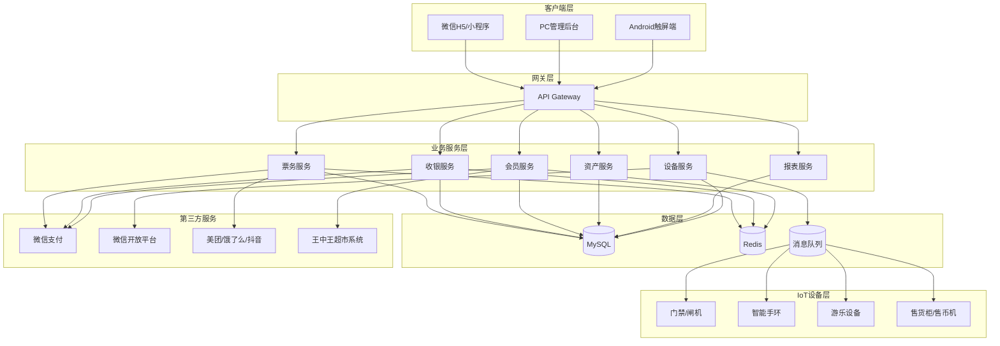
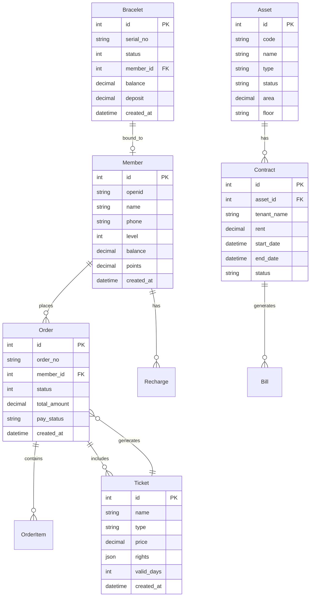
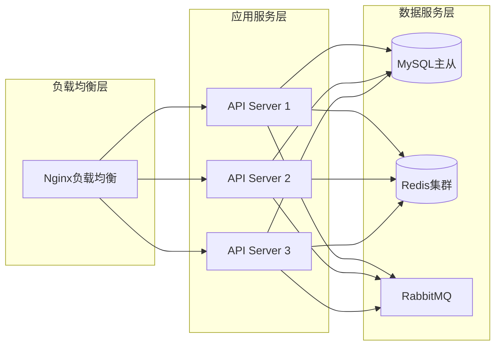

# 技术架构文档

## 1. 系统架构设计



---

## 2. 技术栈选型

### 2.1 前端技术

| 用途 | 技术选型 | 版本 |
|------|----------|------|
| 用户端H5 | React + TypeScript | React 18 |
| PC管理后台 | React + TypeScript | React 18 |
| 状态管理 | Zustand | latest |
| UI组件库 | TailwindCSS + Radix UI | latest |
| 图表库 | Recharts | latest |
| 移动端 | Taro (跨端框架) | v4 |

### 2.2 后端技术

| 用途 | 技术选型 | 版本 |
|------|----------|------|
| 运行环境 | Node.js | 18+ |
| 框架 | Express.js | 4.x |
| ORM | Prisma | latest |
| 数据库 | MySQL | 8.0 |
| 缓存 | Redis | 7.x |
| 消息队列 | RabbitMQ | 3.x |
| 认证 | JWT | - |

### 2.3 开发工具

| 用途 | 工具 |
|------|------|
| 包管理 | pnpm |
| 构建工具 | Vite |
| 代码规范 | ESLint + Prettier |
| 版本控制 | Git |

---

## 3. 项目结构

```
shopping/
├── src/                      # 前端源代码
│   ├── components/           # 公共组件
│   │   ├── ui/              # 基础UI组件
│   │   ├── layout/          # 布局组件
│   │   └── business/        # 业务组件
│   ├── pages/               # 页面
│   │   ├── h5/              # 用户端H5页面
│   │   ├── admin/           # 管理后台页面
│   │   └── manager/         # 管理端小程序页面
│   ├── hooks/               # 自定义Hooks
│   ├── stores/              # Zustand状态库
│   ├── services/            # API服务层
│   ├── types/               # TypeScript类型定义
│   ├── utils/               # 工具函数
│   └── assets/              # 静态资源
│
├── api/                     # 后端源代码
│   ├── src/
│   │   ├── controllers/     # 控制器
│   │   ├── services/        # 业务逻辑
│   │   ├── repositories/    # 数据访问层
│   │   ├── models/          # Prisma模型
│   │   ├── middlewares/     # 中间件
│   │   ├── routes/          # 路由定义
│   │   ├── utils/           # 工具函数
│   │   └── config/          # 配置文件
│   └── prisma/
│       └── schema.prisma    # 数据库Schema
│
├── shared/                   # 共享类型定义
│   └── types/               # 公共类型
│
└── documents/               # 项目文档
```

---

## 4. 路由定义

### 4.1 用户端H5路由

| 路由 | 页面名称 | 功能 |
|------|----------|------|
| /h5/home | 首页 | 轮播图、导航入口 |
| /h5/tickets | 票务中心 | 票种列表与购买 |
| /h5/ticket/:id | 票种详情 | 票种详情与下单 |
| /h5/member | 会员中心 | 个人信息、余额 |
| /h5/my-tickets | 我的门票 | 门票列表、二维码 |
| /h5/orders | 订单记录 | 消费历史 |
| /h5/scan | 扫码点餐 | 扫描二维码点餐 |
| /h5/investment | 招商信息 | 招租信息浏览 |
| /h5/announcement | 公告 | 公告列表 |

### 4.2 PC管理后台路由

| 路由 | 页面名称 | 功能 |
|------|----------|------|
| /admin/dashboard | 工作台 | 数据概览 |
| /admin/tickets | 票务管理 | 票种配置、订单 |
| /admin/cashier | 收银管理 | 收银、流水 |
| /admin/members | 会员管理 | 会员列表、等级 |
| /admin/assets | 资产管理 | 资产台账、合同 |
| /admin/reports | 报表中心 | 各类统计报表 |
| /admin/system | 系统管理 | 用户、角色、权限 |
| /admin/devices | 设备管理 | 设备状态监控 |

### 4.3 管理端小程序路由

| 路由 | 功能 |
|------|------|
| /manager/home | 工作台 |
| /manager/scan | 扫码验票 |
| /manager/orders | 订单管理 |
| /manager/devices | 设备控制 |
| /manager/alerts | 告警中心 |

---

## 5. API定义

### 5.1 票务模块

```typescript
// 票种相关
GET    /api/tickets              // 获取票种列表
GET    /api/tickets/:id         // 获取票种详情
POST   /api/tickets              // 创建票种
PUT    /api/tickets/:id         // 更新票种
DELETE /api/tickets/:id         // 删除票种

// 订单相关
GET    /api/orders               // 获取订单列表
GET    /api/orders/:id          // 获取订单详情
POST   /api/orders               // 创建订单
POST   /api/orders/:id/refund   // 退票
POST   /api/orders/:id/verify   // 验票
```

### 5.2 会员模块

```typescript
GET    /api/members              // 获取会员列表
GET    /api/members/:id         // 获取会员详情
POST   /api/members              // 创建会员
PUT    /api/members/:id         // 更新会员
POST   /api/members/:id/recharge // 充值
GET    /api/members/:id/records  // 消费记录
```

### 5.3 收银模块

```typescript
POST   /api/cashier/checkout     // 收银结算
GET    /api/cashier/records      // 收银记录
POST   /api/cashier/bracelet     // 手环操作
GET    /api/cashier/brace-stats  // 押金统计
```

### 5.4 资产模块

```typescript
GET    /api/assets               // 获取资产列表
GET    /api/assets/:id          // 获取资产详情
POST   /api/assets               // 创建资产
PUT    /api/assets/:id         // 更新资产
GET    /api/assets/:id/contracts // 租赁合同
POST   /api/contracts            // 创建合同
POST   /api/contracts/:id/bill  // 生成账单
```

---

## 6. 数据模型

### 6.1 实体关系图



### 6.2 核心数据表

```sql
-- 会员表
CREATE TABLE members (
    id INT PRIMARY KEY AUTO_INCREMENT,
    openid VARCHAR(64) UNIQUE,
    name VARCHAR(100),
    phone VARCHAR(20),
    level INT DEFAULT 1,
    balance DECIMAL(10,2) DEFAULT 0,
    points INT DEFAULT 0,
    created_at TIMESTAMP DEFAULT CURRENT_TIMESTAMP,
    updated_at TIMESTAMP DEFAULT CURRENT_TIMESTAMP ON UPDATE CURRENT_TIMESTAMP
);

-- 票种表
CREATE TABLE tickets (
    id INT PRIMARY KEY AUTO_INCREMENT,
    name VARCHAR(100),
    type ENUM('unified', 'single', 'package'),
    price DECIMAL(10,2),
    rights JSON,
    valid_days INT,
    status TINYINT DEFAULT 1,
    created_at TIMESTAMP DEFAULT CURRENT_TIMESTAMP
);

-- 订单表
CREATE TABLE orders (
    id INT PRIMARY KEY AUTO_INCREMENT,
    order_no VARCHAR(32) UNIQUE,
    member_id INT,
    total_amount DECIMAL(10,2),
    pay_status ENUM('pending', 'paid', 'refunded'),
    pay_method VARCHAR(20),
    created_at TIMESTAMP DEFAULT CURRENT_TIMESTAMP,
    FOREIGN KEY (member_id) REFERENCES members(id)
);

-- 订单明细表
CREATE TABLE order_items (
    id INT PRIMARY KEY AUTO_INCREMENT,
    order_id INT,
    ticket_id INT,
    quantity INT,
    price DECIMAL(10,2),
    FOREIGN KEY (order_id) REFERENCES orders(id),
    FOREIGN KEY (ticket_id) REFERENCES tickets(id)
);

-- 智能手环表
CREATE TABLE bracelets (
    id INT PRIMARY KEY AUTO_INCREMENT,
    serial_no VARCHAR(64) UNIQUE,
    status ENUM('available', 'in_use', 'lost', 'damaged'),
    member_id INT,
    balance DECIMAL(10,2) DEFAULT 0,
    deposit DECIMAL(10,2),
    created_at TIMESTAMP DEFAULT CURRENT_TIMESTAMP,
    FOREIGN KEY (member_id) REFERENCES members(id)
);

-- 资产表
CREATE TABLE assets (
    id INT PRIMARY KEY AUTO_INCREMENT,
    code VARCHAR(32) UNIQUE,
    name VARCHAR(100),
    type VARCHAR(50),
    area DECIMAL(10,2),
    floor VARCHAR(20),
    status ENUM('available', 'rented', 'maintenance'),
    created_at TIMESTAMP DEFAULT CURRENT_TIMESTAMP
);

-- 租赁合同表
CREATE TABLE contracts (
    id INT PRIMARY KEY AUTO_INCREMENT,
    asset_id INT,
    tenant_name VARCHAR(100),
    rent DECIMAL(10,2),
    start_date DATE,
    end_date DATE,
    status ENUM('active', 'expired', 'terminated'),
    created_at TIMESTAMP DEFAULT CURRENT_TIMESTAMP,
    FOREIGN KEY (asset_id) REFERENCES assets(id)
);

-- 账单表
CREATE TABLE bills (
    id INT PRIMARY KEY AUTO_INCREMENT,
    contract_id INT,
    type ENUM('rent', 'property', 'utility'),
    amount DECIMAL(10,2),
    due_date DATE,
    status ENUM('pending', 'paid', 'overdue'),
    created_at TIMESTAMP DEFAULT CURRENT_TIMESTAMP,
    FOREIGN KEY (contract_id) REFERENCES contracts(id)
);
```

---

## 7. 服务器架构



---

## 8. 安全性设计

### 8.1 认证授权
- JWT Token认证，支持access_token和refresh_token
- 角色权限控制(RBAC)
- 接口访问频率限制

### 8.2 数据安全
- 敏感数据加密存储
- HTTPS传输加密
- 数据备份与恢复机制

### 8.3 审计日志
- 记录所有关键操作
- 支持按时间、用户、操作类型检索
- 日志保留至少6个月
